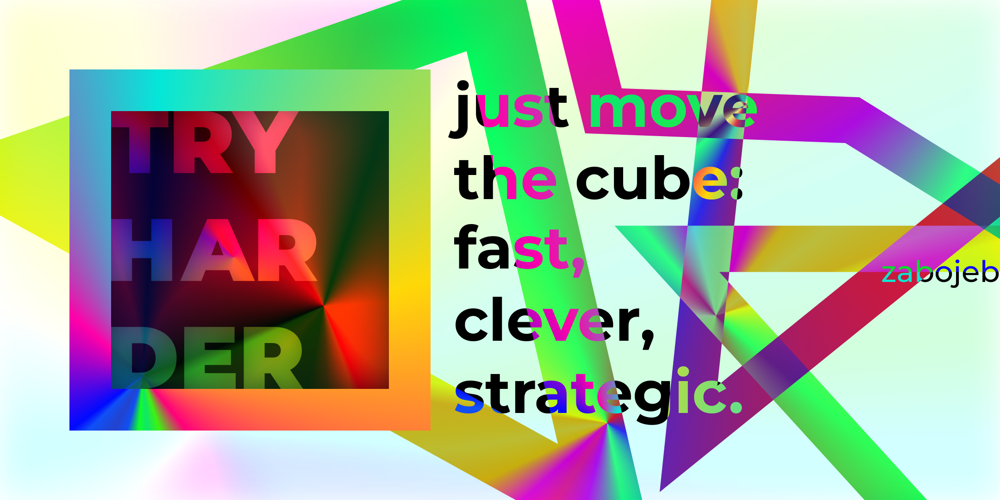

"It's easy, isn't it?" - Me

[Русский](README.ru.md) | English

# TRY HARDER
**TRY HARDER** is a web arcade game, written in **p5.js** with crazy visual effects and procedural generation, in which you just have to move the square.

Move the square fast, clever and strategic.

Your task is to control a square and reach the exit, avoiding collisions with walls. You need to simply guide it through the maze to the exit.
But be careful, the walls can be treacherous!

> [!WARNING]
> There are a lot of flashes and shimmering elements in the game!

### I just want to play!
Game is available on **itch.io**: **[TRY HARDER](https://zabojeb.itch.io/try-harder)**

Also, you can play the game on [GitHub Pages](https://zabojeb.github.io/TRYHARDER/)

## Controls
The controls are simple and intuitive:

- **WASD/keyboard arrows**: Move the square up, down, left and right.
- **Spacebar/Enter**: Restarting the game after losing or winning.

## Superpower
There is a superpower in the game that will help you in difficult situations (I just fixed the generation issues with it).

It allows you to walk through walls and increases your speed slightly for a short period of time.

It can only be used once per game! Use it wisely!

- **LMB/Shift**: Activate Superpower

## Contribute
I wrote this game in a couple nights out of boredom. But I'm really enjoying this project!

At the moment, the game code is extremely unstructured and needs a lot of fixes, tweaks and structuring.
So I would welcome any contributions to the development!

## To-Do List
This list is created to identify the most important vectors of game development and the most important issues.

- **Improve code quality**
- **Add mobile controls and support**
- **Add a PvP mode**
- **Optimize code**
- Any idea you have!

Please feel free to send issues with requests, recommendations and bugs!

---

Made with ❤️️ by zabojeb
